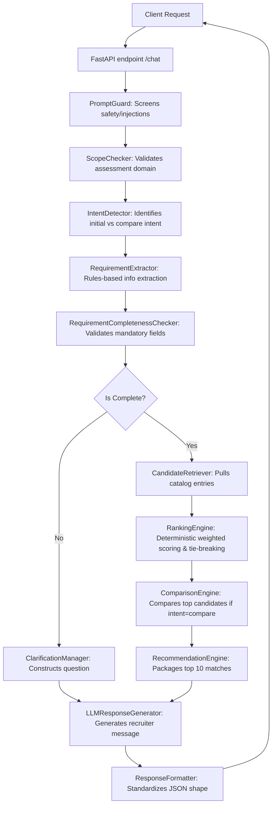

# SHL Assessment Recommender

[](https://www.python.org/)
[](https://fastapi.tiangolo.com/)
[](LICENSE)

A high-performance, stateless FastAPI service designed to help recruitment and hiring teams discover, compare, and recommend matching SHL assessments. The core recommendation pipeline is entirely catalog-grounded, structured, and deterministic, ensuring zero hallucination. An LLM is employed exclusively as a natural language response generator to synthesize recruiter-friendly explanations.

---

## 🏗️ Architecture

The recommendation pipeline follows a strict, sequential request-response architecture:



---

## 📁 Directory Structure

```text
├── app/
│   ├── api/
│   │   ├── __init__.py
│   │   └── routes.py             # FastAPI routing and DI setup
│   ├── config/
│   │   ├── __init__.py
│   │   └── technical_skills.json # Predefined skill dictionary for rule extraction
│   ├── core/
│   │   └── config.py             # Settings using pydantic-settings
│   ├── llm/
│   │   ├── __init__.py
│   │   ├── base_provider.py      # Base provider interface
│   │   ├── grok_provider.py      # xAI Grok provider
│   │   ├── mock_provider.py      # Recruiter-friendly local mock provider
│   │   ├── openai_provider.py    # OpenAI chat completions provider
│   │   └── provider_factory.py   # Factory to instantiate LLM providers
│   ├── models/
│   │   ├── __init__.py
│   │   ├── catalog.py            # Pydantic models for catalog entries
│   │   ├── chat.py               # Request, response, and message schemas
│   │   └── requirements.py       # Hiring requirements and extraction schemas
│   ├── prompts/
│   │   ├── system_prompt.txt     # Global recruiter-assistant directives
│   │   ├── recommendation_prompt.txt # Template for summarizing recommendations
│   │   ├── comparison_prompt.txt # Template for comparative responses
│   │   ├── clarification_prompt.txt # Template for requesting missing details
│   │   └── refusal_prompt.txt    # Template for gracefully refusing out-of-catalog request
│   ├── services/
│   │   ├── candidate_retriever.py # Selects matching candidates from catalog
│   │   ├── catalog_loader.py     # Optimised lazy singleton catalog loader
│   │   ├── chat_service.py       # Orchestrates chat query lifecycle
│   │   ├── clarification_manager.py # Forms missing-criteria questions
│   │   ├── comparison_engine.py  # Performs metadata comparison analysis
│   │   ├── extraction_rules.py   # Individual rules for details extraction
│   │   ├── intent_detector.py    # Detects conversational intent
│   │   ├── llm_response_generator.py # Formulates LLM prompts using text templates
│   │   ├── prompt_guard.py       # Screens for injection keywords
│   │   ├── ranking_engine.py     # Weighted attribute scoring & tie-breaker
│   │   ├── recommendation_engine.py # Formats final recommendations
│   │   ├── requirement_completeness_checker.py # Checks for role, seniority, and skills
│   │   ├── requirement_extractor.py # Main parse loop for conversation turns
│   │   ├── response_formatter.py # Structures output payload
│   │   └── scope_checker.py      # Enforces in-scope topic validation
│   ├── tests/                    # 100% passing test suite
│   └── utils/
│       └── logging_config.py     # Core logging initialization
├── data/
│   └── shl_assessments.json      # Primary catalog data source
├── main.py                       # FastAPI lifespan & application entrypoint
├── requirements.txt              # Project package dependencies
└── Dockerfile                    # Containerization configuration
```

---

## ⚙️ Environment Variables

Copy `.env.example` to `.env` and configure:

| Variable | Description | Default |
|---|---|---|
| `CATALOG_PATH` | Path to the SHL assessment catalog JSON file | `./data/shl_assessments.json` |
| `MAX_RECOMMENDATIONS` | Maximum recommendations to display | `6` |
| `LLM_PROVIDER` | Active provider (`mock`, `openai`, or `grok`) | `mock` |
| `OPENAI_API_KEY` | Key for OpenAI (Required when `LLM_PROVIDER=openai`) | `None` |
| `OPENAI_MODEL` | OpenAI model identifier | `gpt-4o-mini` |
| `GROK_API_KEY` | Key for Grok (Required when `LLM_PROVIDER=grok`) | `None` |
| `GROK_MODEL` | Grok model identifier | `grok-4` |
| `GROK_BASE_URL` | Base URL for Grok API | `https://api.x.ai/v1` |
| `LOG_LEVEL` | Log verbosity level (`DEBUG`, `INFO`, `WARNING`, `ERROR`) | `INFO` |
| `ENVIRONMENT` | Deployment environment (`development` or `production`) | `development` |

---

## 🚀 Running Locally

### 1. Installation
Ensure Python 3.9+ is installed. Create a virtual environment and install packages:

```bash
python -m venv .venv
# On Windows
.venv\Scripts\activate
# On Linux/macOS
source .venv/bin/activate

pip install -r requirements.txt
```

### 2. Startup
Run the server using Uvicorn:
```bash
uvicorn main:app --reload --host 127.0.0.1 --port 8000
```
API Documentation will be available at `http://127.0.0.1:8000/docs`.

---

## 🧪 Running Tests

We run tests using `pytest`. The test suite is optimized with lazy catalog loading to execute in under 1 second.

```bash
python -m pytest
```

---

## ✉️ Sample API Requests & Responses

### POST `/chat`

#### Scenario: Recommendations Request
**Request**
```json
{
  "conversation": [
    {
      "role": "user",
      "content": "I need a Senior Java Developer."
    }
  ]
}
```

**Response (Mock)**
```json
{
  "reply": "Based on the hiring requirements you've shared, I have identified the top SHL assessments for this position. For a Java Developer, the strongest match is designed to evaluate core competencies and relevant technical capabilities.",
  "recommendations": [
    {
      "entity_id": "4034",
      "name": "Core Java (Advanced Level) (New)",
      "link": "https://www.shl.com/products/product-catalog/view/core-java-advanced-level-new/",
      "description": "Multi-choice test that measures the knowledge of basic Java constructs, OOP concepts, files and exception handling...",
      "ranking_score": 0.66,
      "matched_criteria": ["role", "skills", "duration"],
      "explanation": "Core Java (Advanced Level) (New) matched on role fit, technical skill coverage, and available duration.",
      "duration": "13 minutes",
      "job_levels": ["Mid-Professional", "Professional Individual Contributor"],
      "keys": ["Knowledge & Skills"]
    }
  ],
  "end_of_conversation": false
}
```

---

## ⚠️ Limitations & Future Improvements

1. **Role Modifier List Limits**: The extraction rule uses a local keyword-checking engine for skill modifiers (e.g. `java` in `Java Developer`). Integrating a Named Entity Recognition (NER) model would enable extracting arbitrary niche technologies.
2. **Metadata Density**: Some catalog entries contain unstructured description texts. Performing a one-time pre-processing pass to structure all descriptions into key-value attributes would improve overall accuracy.
3. **Stateless Pagination**: Currently returns the top matching recommendations. Adding a pagination token would help in cases where users want to navigate page-by-page.
